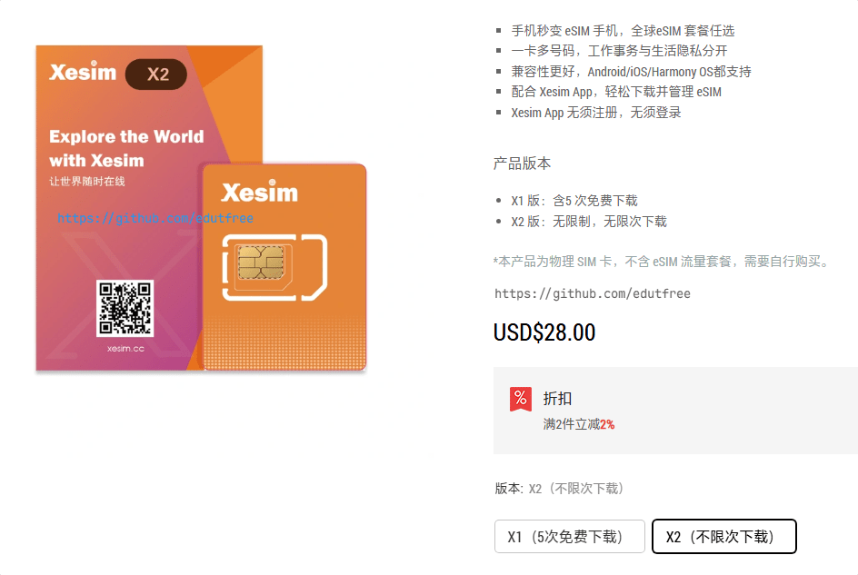
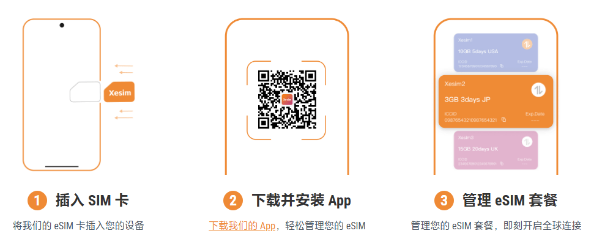

# xesim 让国行手机也能无损秒支持 eSIM

官网：[https://xesim.cc](https://xesim.cc/?DIST=REVH)

## xesim简介

Xesim，让国行手机无损秒支持 eSIM，全球 eSIM 套餐任选；一卡多号，工作事务与生活隐私分开；支持多品牌多型号，iOS 也可下载 eSIM；搭配 Xesim App，轻松下载并管理 eSIM。

Xesim 卡所属的 App 不需要注册和登录就能写卡，也就是即使未来该项目出现问题也不会影响用户使用。

Xesim 与此前的 5ber eSIM 实现类似功能：利用写卡器将 eSIM 卡号复写到实体 SIM 卡中，帮助不支持 eSIM 卡的智能手机通过 Xesim 使用并切换不同的 eSIM 手机卡。

## Xesim专属优惠

Xesim产品目前分为两个版本：

[X1 版（$15美元）](https://xesim.cc/products/xesim?VariantsId=10003)：含5次免费下载（下载不成功不计数）

[X2 版（$28美元）](https://xesim.cc/products/xesim?VariantsId=10004)：无限次下载

专属链接：[https://xesim.cc/?DIST=REVH](https://xesim.cc/?DIST=REVH)

专属9折优惠码：[esim10](https://xesim.cc/?DIST=REVH)（优惠10%）

## Xesim产品功能



**GSMA 国际认证**

```
Xesim 卡是基于 eSIM 技术，内置GSMA认证证书的实体SIM 卡。
支持符合 GSMA 认证要求的 eSIM 供应商。
*有少部分运营商对用户身份和安装设备有特定购买要求，购买前可向eSIM 供应商咨询。
```

**一卡多号**

```
一张卡最多存储 15 个 eSIM，让您工作事务与生活号码分开，保护个人隐私。
```

**全设备兼容**

```
全面支持 Android、iOS、HarmonyOS NEXT 三大手机系统，轻松下载并管理 eSIM套餐。
*合约机，有锁机，定制机除外。查看支持的设备
*iOS、HarmonyOS Next 可通过 Xesim STK 管理eSIM，其中下载新 eSIM 时，需借助卡内现有eSIM数据流量。
```

**多版本选择 不同需求，不同场景，按需选购。**

```
X1 版本：适合 eSIM 初体验用户，内含5 次 eSIM 免费下载。
X2 版本：适合 eSIM 重度用户，提供无限次 eSIM 下载，无任何使用限制。
```

**便捷管理方式**

```
Android 用户可以通过 Xesim App 方式进行 eSIM 管理。
非 Android 用户，无须安装 App，可通过 Xesim STK 方式管理 eSIM。
```

**使用方法**



**使用须知**

1.  Android 用户，建议您使用 Xesim App 或 Xesim STK 中的一种方式管理 eSIM，避免同时使用。
2.  使用 Xesim STK 下载 eSIM 时，请确认卡中已存在可用数据流量的 eSIM。
3.  Xesim卡片中的eSIM启用后， 可以插入到任何移动设备上使用，合约机、有锁机、定制机除外。
4.  X1 版本卡片，每成功下载一个eSIM，即扣减1 次下载权益。如需更多下载次数，可通过 Xesim App 购买。

**购买须知**

1.  所有 Xesim 卡出厂时均为空白卡片，不含任何 eSIM 文件，您需另行从 eSIM 供应商处购买 eSIM 下载后使用。
2.  每张 Xesim 卡最多可同时存储 15 个 eSIM 配置文件，实际数量依赖于各家运营商eSIM 配置文件大小。  
    \*因为各 eSIM 供应商提供的 eSIM 功能各异，实际大小不同，当前 15 个 eSIM 是 Xesim 技术实验室测试的最大理论值，仅供参考，请以实际使用为准。
3.  目前版本之间不支持转换升级。购买时，请您根据自身需求选择 X1 版本或 X2 版本。
4.  Xesim STK 方式理论上支持所有移动设备管理Xesim 卡内 eSIM，有锁机、合约机、定制机除外，以实际使用为准。
5.  X1 版本可以通过Xesim App ，购买下载权益。 Xesim 下载权益一经购买，不支持退款。
6.  Xesim 产品仅支持官方 Xesim App 和 Xesim STK 方式管理 eSIM，用户使用非官方软件或第三方设备而导致Xesim 卡片或内部数据损坏，责任自担。
7.  下单后，订单相关通知将发送至您账户绑定的电子邮箱。
8.  xesim物流从亚洲地区发货，预计送达时间为 2-15 个工作日，具体取决于您所在地区及当地快递效率。若物流延迟，请及时联系客服。
9.  若要取消订单，无论是否发货，均需联系客户服务处理。官网订单，可前往“我的订单”中申请售后。
10.  一旦购买，无论是否发货，在取消订单或退单处理中，均需扣除平台及第三方支付手续费。
11.  若产品有质量问题或使用问题，请在收货后 14 天内联系客户服务获得进一步帮助。
12.  购买前请务必确保您了解产品特性及设备支持情况，否则可能无法享受退货退款服务。详细内容请参阅[发货及退款退货条款](https://xesim.cc/policies/shipping-delivery)。
